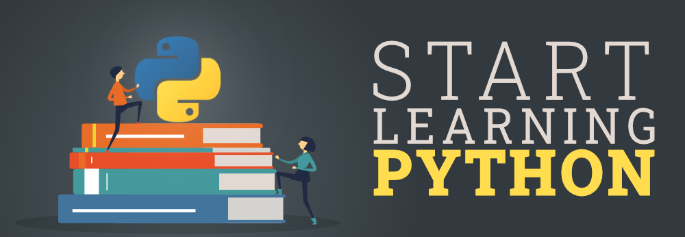

# Learning-Python

## Learning Python Practical Examples.

Learning python is a collection of Python examples and tutorials that anyone can use to learn and practice programming in Python. By forking the repository, you can make your own copy of the repository and add your own examples and tutorials, making it a personalized resource for you to use in your learning.

It's a great way to learn and practice programming because you can see how others have solved similar problems and use that as a reference. Additionally, you can contribute to the community by sharing `pull request` of your examples and learning materials to this repo for the benefit of all.
